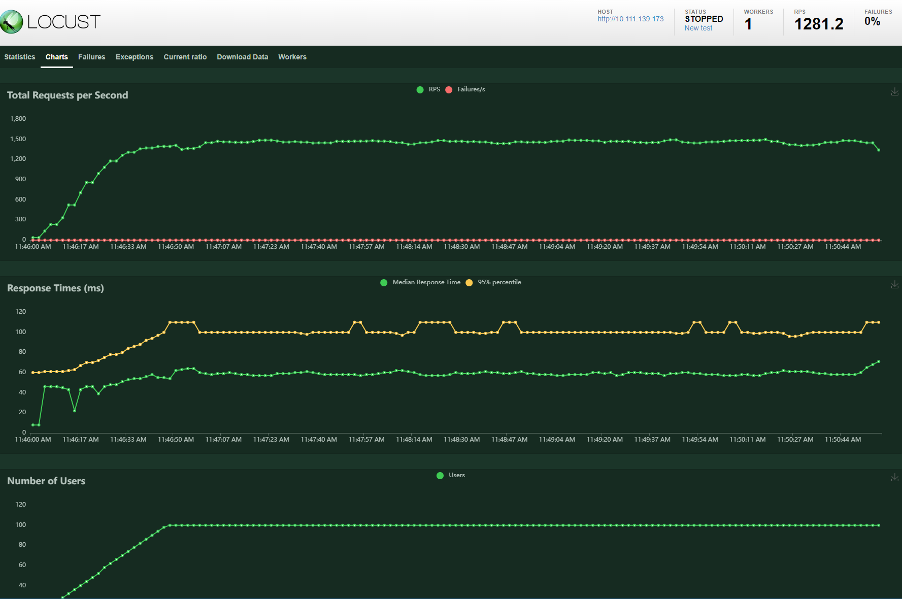

# Movie DB API workshop

## Goal
To have a scalable movie DB API service deployable to kubernetes.

## Constraints and assumptions
- API service response time should be <5ms (assuming this is p95 response time, not average or maximum)
- 24/7 availability with zero downtime
- Movie record structure
  - Title
  - Year
  - List of cast members
  - List of genres
- API 
  - Data is queryable by any of the fields
  - For clarity and simplicity, assuming the following:
    - Filter conditions are to be combined using AND
    - Title filter is a substring search (title should contain the queried substring)
    - Year is exact match filter
    - Cast and genre filters to accept exact match using IN (e.g. query on genre `Action` will include all movies having `Action` among its genres)
    - Data should be paginated
      - Number of total results is not required, only the flag whether we have more pages 
- Data ingestion
  - Seed database is available in `wikipedia-movie-data` repository
  - Data volume is small and is going to fully fit in memory (3.4Mb)
  - Data updates are going to be received into write-only S3 bucket in the same json format as the seed db
  - Time to ingest data updates is not very important (up to 1 day is ok)
  - Movie matching key for ingestion will be combination of `title` and `year`
  - Records will be merged using last modified timestamp in the S3 bucket
  - No deduplication of seed data is required
  - Conflict resolution is out of scope
- Only basic cloud resource configuration is required, buckets and names - e.g. IAM roles and policies, networks, S3 bucket configuration, EKS configuration is out of scope
- API or data updates authentication and authorization are out of scope of this exercise


## Technical design
We have two main activities to focus on - data ingestion and API serving.

### Data ingeston
Data updates are going to be delivered into write-only S3 bucket (write-only for senders).
Data ingestion process should be able to preprocess data updates and store them in the form suitable for API serving.
As the lead time requirements for data ingestion are relaxed, no real-time updates are needed, we're going to run batch job on the regular basis.
The output of the data ingestion is highly dependent on the format required by API.

### Query API
The query interface combines query predicates with variable selectivity.
For example query by year will return hundreds of records, while query by exact movie name - only one.
Predicates use and selectivity is not known in advance. 
We could try to predict selectivity based on statistics and use it to select an order to combine predicates.
We could also use combination of techniques like b-tree indices, bitmaps and hash joins to speed up the search.
However, given the size of the data, the most efficient would be just plain search in memory.
Due to the same reasons, there's no benefits in using off-the-shelf solutions:
- With in-memory data store, like redis, we won't have 'contains' search, combining predicates will be a problem 
- An RDBMS would solve query optimization, but it is going be slower due to performance overheads due to the need of RDBMS to support numerous configurations and flexibility
- Full-text search engines, like ElasticSearch, would suffer from the same problems as RDBMS    

Network overhead would erase all the gains of the above options, if any.
So the most efficient option is a plan full scan over data in-memory of the API process.
A query results caching can help to reduce the load further.
This can be implemented directly in the API process.

API server can read full data snapshot from S3 on start.

High avaiability requirements are going to be satisfied by k8s deployment with multiple replicas.

### Choice of data store
Due to the reasons above, the API server can read full data snapshot from S3 on start and provide query API over it.
The server pods can be restarted periodically on a rolling bases to reload data.

### Choice of languages and framework
For efficiency, a low-level language and framework would be the most adequate option.
Python would not be normally a language of choice given the scalability requirements, but it is still chosen purely based on convenience.
Fast API is chosen as the most lightweight REST API framework for Python.  
itertools lru_cache is used to cache search results.

Additionally, a version of API service has been written in Rust using Rocket.rs framework to optimize data serving further.

### Cloud infrastructure
To increase iteration time and avoid dependency on third party (and avoiding cloud API authorization hassles), `localstack` is going to be used to simulate S3.

### Provisioning within kubernetes cluster
A basic Helm chart is created to simplify deployment of the service in the k8s cluster. 

### Stress testing
`Locust` is used to stress test client API queries and measure response time under load.  


## Implementation

### Components
The solution consists of:
- `src/py_movie_db`: Python version of API server
- `src/rs_movie_db`: Rust version of API server 
- `src/movie_indexer_job`: Data ingestion job
- `src/load_runner`: `locust` script and runner
- `src/movie-db-chart`: Helm chart
- `infra`: kubernetes workload and locust configuration


### Query API
The api accepts queries in search parameters in the root url:
- `title_contains`: substring to search in the movie title
- `year`: year of the movie
- `cast`: exact name of cast member
- `genre`: exact genre
- `page`: page number
- `page_size`: page size

Examples:
- `http://<yourhostname>/?title_contains=story`
- `http://<yourhostname>/?year=2000`
- `http://<yourhostname>/?title_contains=the&year=2000&genre=Comedy`


### Python service
Python version of the service is created using Fast API framework.
It's relatively well optimized, utilizing list comprehension and itertools, string interning etc.
It utilizes lru result cache.
It also provides dedicated liveness and health check endpoints.

### Rust service
Rust version of the service is created using rocket.js framework.
It does not do caching of results atm.

### kubernetes workload
Kubernetes resources consist of:
- Python-based API service
- HPA autoscaling configuration for Python-based API service 
- Rust version of API service
- Seed job to seed data into S3 bucket
- Cronjob to ingest data updates from S3 inbox bucket
- Configmap, ingress configuration, dummy secrets for aws client

Python API service will increase number of replicas depending on CPU usage.


### Helm chart
A basic Helm chart is provided to deploy the workload.
It has dependencies on `localstack` and private registry, it's implied this already exists in the environment.
See Set up section for deployment details.


## Performance

The internal performance counters in the API server demonstrate <2ms average response times (available under `http://<yourhostname>/perf_counters`), see `avg_request_time.http_search_request`:
```
{
   "request_counts":{
      "find_movies":357,
      "cached_find_movies":5889,
      "http_search_request/":5889
   },
   "elapsed_sum":{
      "find_movies":0.8602577280835249,
      "cached_find_movies":0.8970306365517899,
      "http_search_request/":8.386440065834904
   },
   "avg_request_time":{
      "find_movies":0.002409685512839005,
      "cached_find_movies":0.00015232308312986754,
      "http_search_request/":0.0014240855944701823
   }
}
```
However on Docker Desktop on Windows WSL2, the client-reported response times are order of magnitude higher.
See the Locust screenshot for Python service:

Most likely this is due to networking overhead of WSL2 and non-production kubernetes configuration.

The Rust version of the service, although provides slightly higher throughput and low response times, suffers from the same networking overheads:


## Set up

### Prerequisites
- `docker-desktop` with `kubernetes` 
- `helm`
- `make`
- To run k8s version:
  - A private Docker registry, you can start one in docker:
    - `docker run -d -p 5000:5000 --restart=always --name registry registry:2`
    - Allow insecure registry in docker daemon config `~/.docker/daemon.json`: `"insecure-registries":["<yourhostname-or-IP>:5000"]`

### Configuration
- Clone the repository
- Copy `.env.dist` to `.env.dev`
- Only if you will run locally or in docker-compose, for k8s you can skip this step: 
  - Change `AWS_ENDPOINT_URL`, `MOVIE_SERVER_URL` to point to your local IP

### Running in k8s - Prerequisites
- You might need to import docker registry credentials:
  - `kubectl create secret generic regcred --from-file=.dockerconfigjson=/<path-to-your-home>/.docker/config.json --type=kubernetes.io/dockerconfigjson`
- You might need to install nginx ingress in a fresh Docker Desktop install 
  - `helm upgrade --install ingress-nginx ingress-nginx --repo https://kubernetes.github.io/ingress-nginx --namespace ingress-nginx --create-namespace`
- You might want to install metrics server in a fresh Docker Desktop install 
  ```
  helm repo add metrics-server https://kubernetes-sigs.github.io/metrics-server/
  helm upgrade --install metrics-server metrics-server/metrics-server --namespace kube-system
  kubectl -n kube-system patch deployment metrics-server --type=json -p='[{"op": "add", "path": "/spec/template/spec/containers/0/args/-", "value": "--kubelet-insecure-tls"}]]'
  ```
- Install `localstack` helm chart
  ```
  helm repo add localstack-repo https://helm.localstack.cloud
  helm upgrade --install localstack localstack-repo/localstack
  ```
- Build, tag and push docker images to your the docker registry
  - `make build` 
- To cleanup, run:
  ```
  helm uninstall localstack
  ```


### Running in k8s using helm chart
- Install helm chart
  - `make k8s-helm-install`
- Uninstall helm chart
  - `make k8s-helm-uninstall`


### Running in k8s using yaml files directly
- Review `yaml` files in `infra` and set your local IP address where necessary
- Init S3 buckets and upload seed data
  - `make k8s-seed`
- To start API server and schedule ingestion cronjob:
  - Run `make k8s-create`
  - API server will be running on your ingress on http://<yourhostname>/movie-db-api/
- To run stress test using `locust`:
  - Run `make k8s-stress`
  - Locus web server will be running on your ingress on http://<yourhostname>/locust/
  - Enter your API server url, e.g. `http://<yourhostname>/movie-db-api`, number of users and users increment and watch the graphs
- To cleanup, run:
  ```
  make k8s-delete
  make k8s-seed-delete
  make k8s-stress-clean
  ```

### Running using docker-compose
- Start `localstack` and keep running in the background
  - `make dc-start-infra`
- Init S3 buckets and upload seed data
  - `make dc-seed`
- To run ingestion job:
  - Run `make dc-ingest`
- To start Python API server:
  - Run `make dc-start`
  - API server will be running on http://localhost:8101
- Alternatively, to start Rust API server:
  - Run `make dc-start-rs`
  - API server will be running on http://localhost:8000

### Running locally
- Install dependencies
  - `cd src/movie_indexer_job && poetry install --no-root`
  - `cd src/py_movie_db && poetry install --no-root`
  - `cd src/load_runner && poetry install --no-root`
- Start `localstack` container: `docker run --rm -it -p 4566:4566 -p 4510-4559:4510-4559 localstack/localstack`
- Init S3 buckets and upload seed data
  - `make local-seed`
- To run ingestion job:
  - Run `make local-ingest`
- To start API server:
  - Run `make local-start-server`
  - API server will be running on http://localhost:8100

### Compiling Rust service locally
- Prerequisites: Rust with cargo
- To compile and start the service:
  - `make local-start-rs-server`
